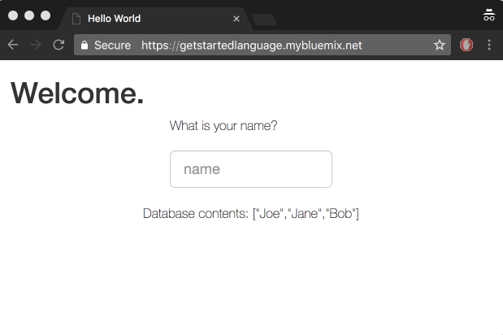
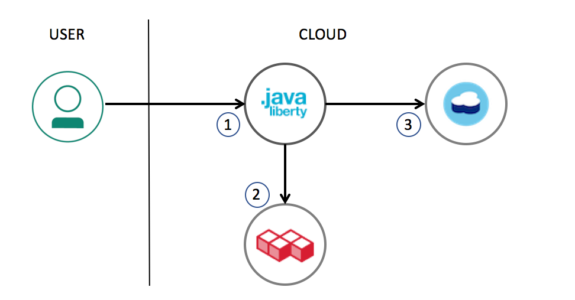
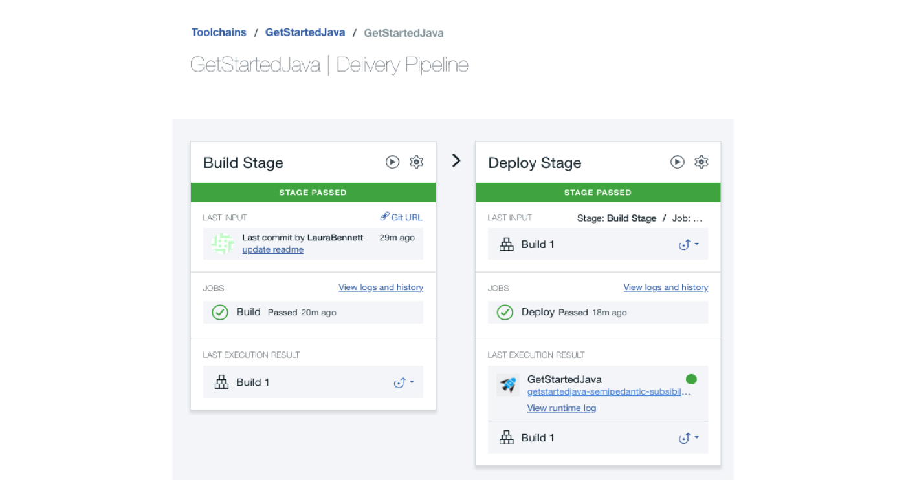
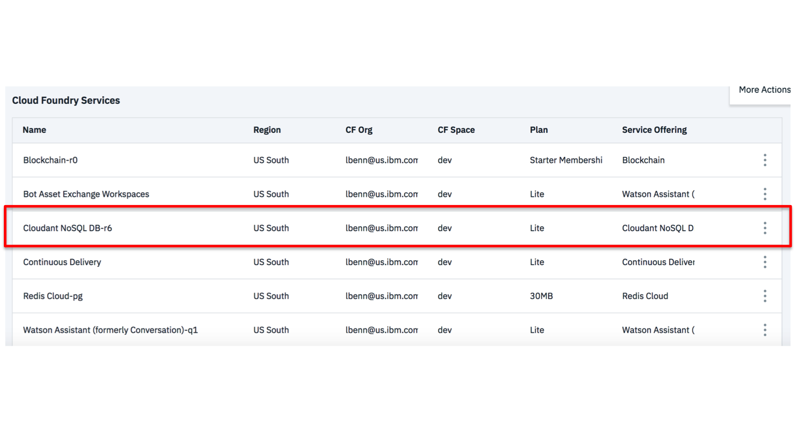
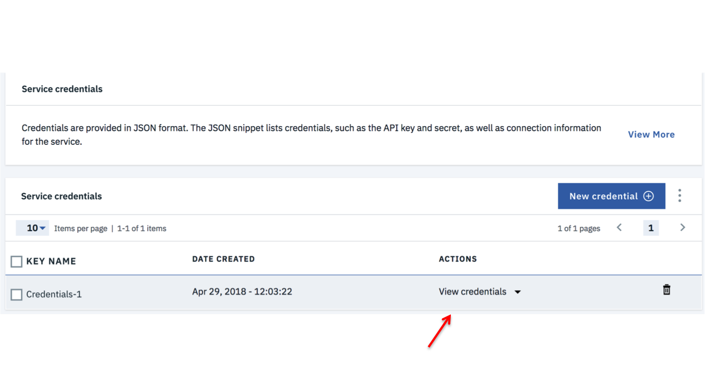
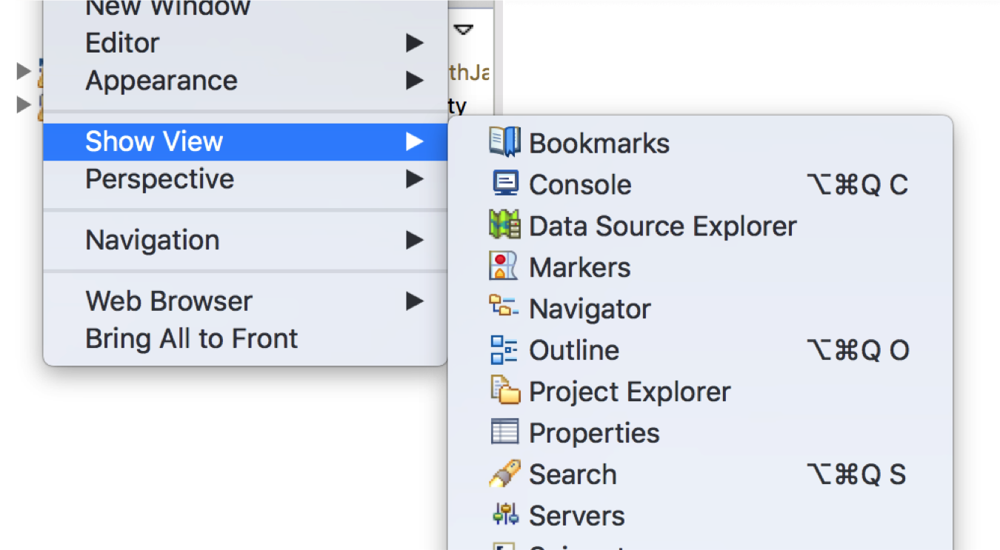
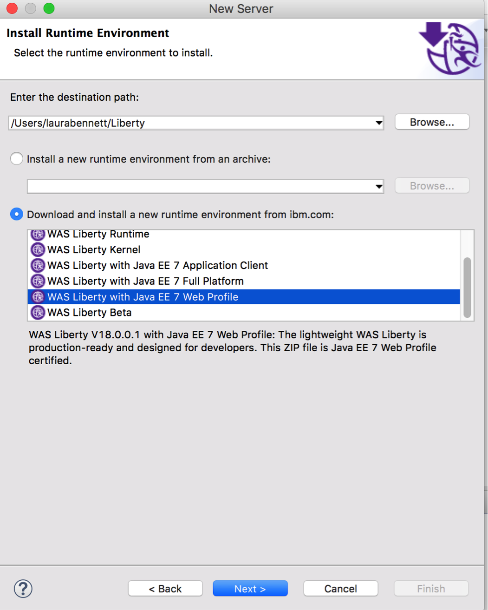
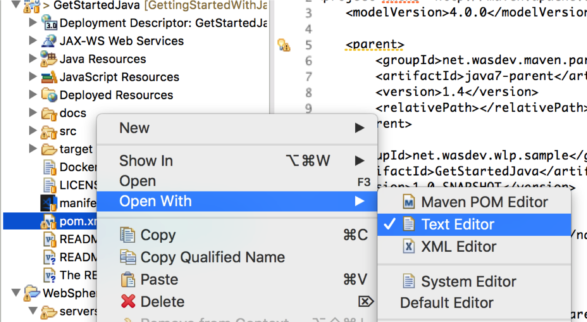
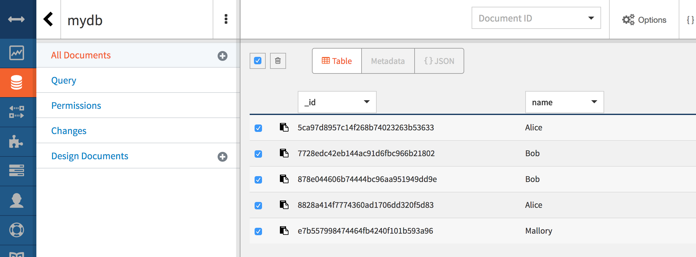
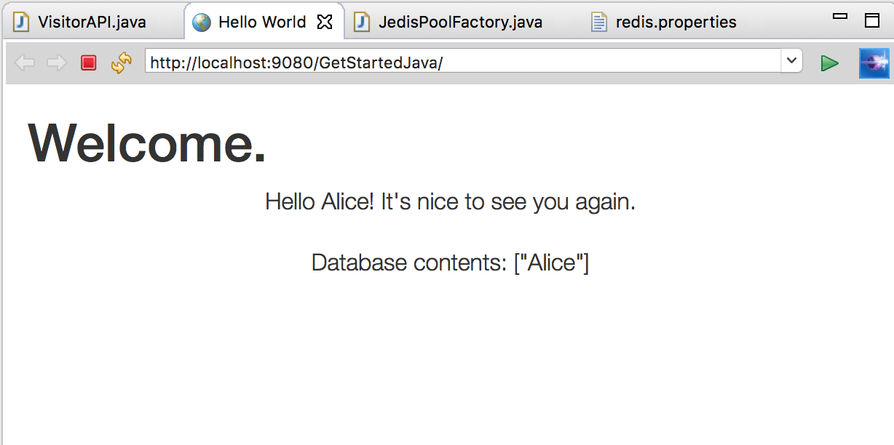

<!--change the repos -->
<!--change the tracking number -->
#[](https://travis-ci.org/IBM/watson-banking-chatbot)

<!--Add a new Title and fill in the blanks -->
# Get Started Using Liberty on IBM Cloud with your Java Applications
In this Code Pattern, we will show you how to build Java applications using Liberty on IBM Cloud Platform.
This journey leverages multiple services:
* The Cloudant NoSQL service is used as a DB to hold _name_ entries submitted from the application
* The Redis Cloud Service is used as a cache to help filter duplicates from the Cloudant DB

This code pattern is designed for developers with an interest in creating Java applications using an open source platform such as IBM Eclipse Tools for Bluemix.

<p align="center">
  <kbd>
    
  </kbd>
</p>

There are two parts to this pattern:
* The first part consists of deploying the code using a Cloudant backend
* The second enhances the application further to include Redis as cache broker

When the reader has completed this Code Pattern, they will understand how to:

* Set up a Liberty development environment
* Deploy a Java application locally and on IBM Cloud
* Integrate an IBM Cloud DB service with a Java application

<!--Remember to dump an image in this path-->


## Flow
<!--Add new flow steps based on the architecture diagram-->
1. User sets up and imports code into Liberty Runttime Environment
2. User provides name for the app
2. App checks Redis cache to see if name has already been added
3. If name hasn't been added, store name in Cloudant

<!--Update this section-->
## Included components
* [IBM Eclipse Tools for Bluemix](https://developer.ibm.com/wasdev/downloads/#asset/tools-IBM_Eclipse_Tools_for_Bluemix): The Tools enable rapid deployment and integration of many services from IBM Cloud into your applications, including such services as Watson and big data analytics
* [Maven](https://maven.apache.org/download.cgi): Maven is a tool that can now be used for building and managing any Java-based project
* [Redis](https://redis.io/): Redis is an open source (BSD licensed), in-memory data structure store, used as a database, cache and message broker.

Note: these services are free for those who have a Lite account.  Redis does offer a free version on IBM Cloud.


<!--Update this section-->
## Featured technologies
* [IBM Cloud](ibm.com/cloud/): The IBM Cloud offers a broad cloud computing portfolio services.
* [WebSphere Application Server Liberty](https://www.ibm.com/support/knowledgecenter/en/SSAW57_liberty/com.ibm.websphere.wlp.nd.multiplatform.doc/ae/cwlp_about.html): Liberty is a highly composable, fast to start, dynamic application server runtime environment.
* [Git Cloud Foundry](https://github.com/cloudfoundry/cli#downloads): The official command line client for Cloud Foundry

## Running the Application
Follow these steps to setup and run this code pattern manually. The steps are described in detail below.

## Steps
1. [Clone the Sample Application](#1-clone-the-sample-application)
2. [Run the application locally](#2-run-the-application-locally)
3. [Prepare the application for deployment](#3-prepare-the-application-for-deployment-to-ibm-cloud)
4. [Deploy to IBM Cloud](#4-deploy-to-ibm-cloud)
5. [Add a Database](#5-add-a-database)
6. [Use the Database](#6-use-the-database)
7. [Extending this sample to use Compose for Redis](#7-extending-this-sample-to-use-compose-for-redis)
8. [Import the code into Eclipse](#8-import-the-code-into-eclipse)
9. [Create a Liberty Server Definition](#9-create-a-liberty-server-definition)
10. [Add a Maven dependency for the Jedis Redis client](#10-add-a-maven-dependency-for-the-jedis-redis-client)
11. [Update the API endpoint class](#11-update-the-api-endpoint-class)
12. [Add a factory to create a Jedis connection pool](#12-add-a-factory-to-create-a-jedis-connection-pool)
13. [Add the Properties file for use when running locally](#13-add-the-properties-file-for-use-when-running-locally)
14. [Test the Code Locally](#14-test-the-code-locally)
15. [Publish to IBM Cloud](#15-publish-to-ibm-cloud)


## 1. Clone the Sample Application

```
$ git clone https://github.com/IBM/UsingLibertytoBuildJavaApplications
```


For the first part of this pattern, you have three deployment options:
1. Create an [IBM Cloud account](https://console.bluemix.net/registration/?target=%2Fdashboard%2Fapps) and complete the first step of this application by deploying it directly to the IBM Cloud by using the `Deploy to IBM Cloud` button below. When you are done with this step - proceed onto 
2. Proceed to [Run the application locally](#2-run-the-application-locally)
3. Complete both steps:
    * [Prepare the application for deployment](#3-prepare-the-application-for-deployment-to-ibm-cloud)
    * [Deploy to IBM Cloud](#4-deploy-to-ibm-cloud)

For all three steps, once you complete the option you choose, proceed onto [Add a Database](#5-add-a-database).

## Deploy to IBM Cloud
<!--Update the repo and tracking id-->
[](https://bluemix.net/deploy?repository=https://github.com/ljbennett62/GetStartedJava)

1. Press the above ``Deploy to IBM Cloud`` button and then click on ``Deploy``.

<!--optional step-->
2. In Toolchains, click on Delivery Pipeline to watch while the app is deployed. Once deployed, the app can be viewed by clicking 'View app'.


<!--update with service names from manifest.yml-->
3. To see the app and services created and configured for this Code Pattern, use the IBM Cloud dashboard. The app is named `GetStartedJava` with a unique suffix. 


## 2. Run the application locally

On the command line, change the directory to where you cloned the sample application

```
$ cd UsingLibertytoBuildJavaApplications (or what ever directory structure you used)
```

Make sure you have installed [Maven](https://maven.apache.org/download.cgi). Use Maven to install dependencies and build the .war file

```
$ mvn clean install
```

Run the application locally on Liberty

```
$ mvn install liberty:run-server
```

When you see the message _The server defaultServer is ready to run a smarter planet_, you can view your application at http://localhost:9080/UsingLibertytoBuildJavaApplications".

To stop your application, press Ctrl-C in the command-line window where you started the application.

## 3. Prepare the application for deployment to IBM Cloud
To deploy to IBM Cloud, it can be helpful to set up a manifest.yml file. The manifest.yml includes basic information about your app, such as the name, how much memory to allocate for each instance and the route. We've provided a sample manifest.yml file in the UsingLiberyToBuildJavaApplications directory.

```
  applications:
   - name: GetStartedJava
     random-route: true
     path: target/GetStartedJava.war
     memory: 512M
     instances: 1
```

Note: In this manifest.yml file, random-route: true generates a random route for your app to prevent your route from colliding with others. If you choose to, you can replace random-route: true with host: myChosenHostName, supplying a host name of your choice.

## 4. Deploy to IBM Cloud

Deploy your app to one of the following IBM Cloud regions. For optimal latency, choose a region that's closest to your users.


Set the API endpoint by replacing <API-endpoint> with the endpoint for your region.

```
$ bx api <API-endpoint>
```

Log in to your IBM Cloud account.

```
$ bx login
```

If you cannot log in using the cf login or bx login commands because you have a federated user ID, use either the cf login --sso or bx login --sso commands to log in with your single sign on ID. See [Logging in with a federated ID](https://console.bluemix.net/docs/iam/login_fedid.html#federated_id) to learn more.

From within the `UsingLibertytoBuildJavaApplications` directory, push your application to IBM Cloud.

```
$ bx cf push
```

Deploying your application can take a few minutes. When deployment completes, you'll see a message that your app is running. View your app at the URL listed in the output of the push command, or view both the app deployment status and the URL by running the following command:

```
$ bx cf apps
```


**Tip:** You can troubleshoot errors in the deployment process by using the ```bx cf logs <Your-App-Name> --recent``` command.

## 5. Add a Database

Next, we'll add a NoSQL database to this application and set up the application so that it can run locally and on IBM Cloud.

* In your browser, log in to IBM Cloud and go to the Dashboard. Select **Create Resource**.
Choose the **Data and Analytics** section, then select **Cloudant NoSQL DB** and create your service.
Go to the **Connections** (on the left-hand navigation) view and select your application, then **Create connection**. You may need to select **connect to app**.

* Select **Restage** when prompted. IBM Cloud will restart your application and provide the database credentials to your application using the ```VCAP_SERVICES``` environment variable. This environment variable is available to the application only when it is running on IBM Cloud.

**Tip:** Environment variables enable you to separate deployment settings from your source code. For example, instead of hardcoding a database password, you can store this in an environment variable which you reference in your source code.

## 6. Use the Database

We're now going to update your local code to point to this database. We'll store the credentials for the services in a properties file. This file will get used ONLY when the application is running locally. When running in IBM Cloud, the credentials will be read from the ```VCAP_SERVICES``` environment variable.

1. In your browser, go to IBM Cloud, select Dashboard and select your Cloudant service under the Cloud Foundry Services section:


2. click **Service Credentials** on the left-hand navigation

3. click on View Credentials


4. Copy and paste just the url from the credentials to the url field of the /src/main/resources/cloudant.properties file (relative to the UsingLibertytoBuildJavaApplications directory), and save the changes.

5. Restart the server

```
$ bx cf push
```

Refresh your browser view at [http://localhost:9080/UsingLibertytoBuildJavaApplications/](http://localhost:9080/UsingLibertytoBuildJavaApplications/). Any names you enter into the app will now get added to the database.


Your local app and the IBM Cloud app are sharing the database. Names you add from either app will appear in both when you refresh the browsers.


**Tip** Remember, if you don't need your app live on IBM Cloud, stop the app so you don't incur any unexpected charges.

## 7. Extending this sample to use Compose for Redis

This pattern, so far, has a behavior that could be improved with some very simple application logic. When entering the same name twice, the application will add the name to the database a second time. How can we make this better and provide an example of combining a caching service with a data service like Cloudant?

In this part of the pattern, you'll leverge the IBM Eclipse Tools for Bluemix to change the code to use Redis as a cache, either locally or using the Compose for Redis service on Bluemix.

## 8. Import the code into Eclipse

> For developing and deploying with Eclipse, IBM® Eclipse Tools for Bluemix provides plug-ins that can be installed into an existing Eclipse environment to assist in integrating the developer's integrated development environment (IDE) with Bluemix.

> Download and install [IBM Eclipse Tools for Bluemix](https://developer.ibm.com/wasdev/downloads/#asset/tools-IBM_Eclipse_Tools_for_Bluemix).


Import the UsingLibertytoBuildJavaApplications.java code into Eclipse using `File` -> `Import` -> `Maven` -> `Existing Maven Projects` option.


## 9. Create a Liberty Server Definition

  Get to servers view by clicking from the Menu bar at the top select `Window` -> Show View -> Servers. You will see the Server view hightlighted at the bottom of Eclipse platform.

  


  - In the `Servers` view right-click -> `New` -> `Server`
  - Select `IBM` -> `WebSphere Application Server Liberty` (See under IBM)
  - Enter a destination path (/Users/USERNAME/liberty)
  - Select `Download and install a new runttime environment from ibm.com`
  - Choose `WAS Liberty with Java EE 7 Web Profile`
  - Continue the wizard with default options to Finish


   


  In a few seconds, your application should be running at [http://localhost:9080/UsingLibertytoBuildJavaApplications/[(http://localhost:9080/UsingLibertytoBuildJavaApplications/)]

## 10. Add a Maven dependency for the Jedis Redis client

  Use Eclipse to edit the `pom.xml` file to add a Maven dependency to include Jedis.

  

   Inside the `pom.xml` file, right after the `javax.ws.rs` dependency and before the closing `</dependencies>` tag, add the following and then save the file (around line 63):

    ```
    <dependency>
      <groupId>redis.clients</groupId>
      <artifactId>jedis</artifactId>
      <version>2.9.0</version>
    </dependency>
    ```

## 11. Update the API endpoint class

In this step, you'll add a little bit of code to adjust the backend logic used by the application to work with Redis as a cache. Open the `src/main/java/wasdev/sample/rest/VisitorAPI.java` file.

1.  Add imports for Jedis and JedisPool. These can go in at line 31, appending before the `import wasdev...` statements.

    ```java
    import redis.clients.jedis.Jedis;
    import redis.clients.jedis.JedisPool;
    import wasdev.sample.store.JedisPoolFactory;
    ```

2.  Copying the style of the example, add after the statement `VisitorStore store = VisitorStoreFactory.getInstance()` on line 42, a statement that retrieves the `JedisPool` instance.

    ```java
    //Our database store
    VisitorStore store = VisitorStoreFactory.getInstance();

    //Get instance of our Jedis pool
    JedisPool pool = JedisPoolFactory.getInstance();
    ```


3.  Update the code in the `newToDo` method marked with the `@POST` annotation to perform some checking when a `store` is available for persisting visitors. Starting near line 109, *replace* the original code:

    ```java
    store.persist(visitor);
    return String.format("Hello %s! I've added you to the database.", visitor.getName());
    ```

    With code that will get a Jedis instance from the pool, and see if a user has already been added. If so, send a modified greeting. If not, persist the user to the store and add the user name as a key to the cache.

    ```java
    try (Jedis jedis = pool.getResource()) {
        /// check to see if this user is already in the cache
        if ( jedis.get(visitor.getName()) != null ) {
          return String.format("Hello %s! It's nice to see you again.", visitor.getName());
        }
        store.persist(visitor);
        jedis.set(visitor.getName(),"persisted");
        return String.format("Hello %s! I've added you to the database.", visitor.getName());

    } catch (Exception e) {
      // land here if there is no Redis service, implement default behavior
      store.persist(visitor);
      return String.format("Hello %s! I've added you to the database.", visitor.getName());
    }
    ```

> For the case of a cache hit, this change to the code avoids the cost of persisting the same data to the data store additional times. Jedis implements Closeable, so it will be auto-closed after the return or the last statement in the `try`. In the case where no Redis service is available, the catch on the exception defaults to the original behavior.

4.  Save the edits to the file. At this point, there will be errors reported by Eclipse since the factory method has not been created so **Cancel** instead of redeploying the application to Liberty if it is currently running.

## 12 Add a factory to create a Jedis connection pool

This step is quite a bit more involved.  JedisPool is a threadsafe pool of network connections. You can use the pool to reliably create several Jedis instances, given you return the Jedis instance to the pool when done. Doing this helps overcome strange errors that can occur when multi-threading and achieve great performance.

1.  Begin by copying the `/src/main/wasdev.sample.store/VisitorStoreFactory.java` class to a class file called `/src/main/wasdev.sample.store/JedisPoolFactory.java`. Add in imports after the `package` statement.

    ```java
    package wasdev.sample.store;

    import java.net.URI;
    import java.net.URISyntaxException;

    import com.google.gson.JsonObject;

    import redis.clients.jedis.JedisPool;
    ```

2. Rename the class to `JedisPoolFactory` and replace the constructor for the class.

    ```java
    public class JedisPoolFactory {

        private static JedisPool pool;
        static {
            try {
                JedisPool jp = new JedisPool(getRedisURI());
                pool = jp;
            } catch (Exception e) {
                pool = null;
            }
        }
    ```

    > To keep the code changes simple, we will add to this factory class the `getRedisURI` method for creating a URI to use in the `JedisPool` constructor.

3.  Update the `getInstance` method to return the `JedisPool`

    ```java
    public static JedisPool getInstance() {
      return pool;
    }
    ```

4.  Using a slightly modified version of the code from `CloudantVisitorStore.java`, obtain the credentials for the Redis instance and provide them as a `URI` object. You will see in `CloudantVisitorStore.java` that this code block returns a `String`, but for the `JedisPool` constructor, a `String` argument is only parsed for a hostname, and not interpreted as a full url. Add after the `getInstance` method in the JedisPoolFactor.java file:

    ```java
    private static URI getRedisURI() {
      String url;
      URI uri;

      if (System.getenv("VCAP_SERVICES") != null) {
        // When running in Bluemix, the VCAP_SERVICES env var will have the credentials for all bound/connected services
        // Parse the VCAP JSON structure looking for redis.
        JsonObject redisCredentials = VCAPHelper.getCloudCredentials("redis");
        if(redisCredentials == null){
          System.out.println("No redis cache service bound to this application");
          return null;
        }
        url = redisCredentials.get("uri").getAsString();
      } else {
        System.out.println("Running locally. Looking for credentials in redis.properties");
        url = VCAPHelper.getLocalProperties("redis.properties").getProperty("redis_url");
        if(url == null || url.length()==0){
          System.out.println("To use a database, set the Redis url in src/main/resources/redis.properties");
          return null;
        }
      }
      try {
        uri = new URI(url);
          return uri;
      } catch (URISyntaxException e) {
        // TODO Auto-generated catch block
        e.printStackTrace();
        return null;
      }
    }
    ```

5. Don't forget to keep the close } at the end of the JedisPoolFactor class definition and save the file.

## 13. Add the Properties file for use when running locally

1.  Copy the `src/main/resources/cloudant.properties` file to `src/main/resources/redis.properties` and update line 3 to: `redis_url=`

    > Since this will be parsed as a full URI, if you want to use a local copy of redis, instead of providing `localhost` as the value, set it to be `redis://localhost:6379/`

## 14. Test the Code Locally

1.  There should be no code errors after all of the updates are complete and the local Liberty server should automatically refresh. Access the application at http://localhost:9080/GetStartedJava

2.  Add a user in the application. And then add a user of the same name. Since there is no Redis service defined, duplicates will still be successful.

3.  In IBM Cloud, go to the Cloudant dashboard for the service, if there are any documents listed, select all of them in the `mydb` database and then delete them:

    

4.  Create a Redis instance: Either start a local copy of Redis and update `redis.properties` with the value `redis://localhost:6379/` OR create a Compose for Redis service instance in Bluemix using the service catalog and copy the `URL` credential to the `redis.properties` file.

5.  After updating the `redis.properties` file, restart the application on Liberty.

6.  Use the application again. Try to use the same name twice. At this point, Redis will catch the submission and prevent duplicates.

    

## 15. Publish to IBM Cloud

1.  With the application working correctly, select the application from the navigator and select **Run As**->**Maven install** to build and updated version of the war file.

2.  If you have created a Compose for Redis service on Bluemix, publish the application to Bluemix. When using the Add application tool, select both the Cloudant and Redis services provisioned in Bluemix.

3.  Check status on the Bluemix dashboard, and then access the application to test it out. If you need to re-synchronize the cache and Cloudant instances, use the redis command-line shown in the service manage panel and the `flushdb` command to remove all inserted keys. Then from the Cloudant dashboard, remove all documents from `mydb`.


<!--Include any relevant links-->

# Links
* [Liberty for Java](https://console.bluemix.net/docs/runtimes/liberty/index.html#liberty_runtime)
* [Libery Overview](https://www.ibm.com/support/knowledgecenter/SSEQTP_liberty/com.ibm.websphere.wlp.doc/ae/cwlp_about.html)
* [Write Secure Java Web Applications](https://console.bluemix.net/docs/runtimes/liberty/secureWebApp.html#secure_java_web_app)
* [Develop Applications using IBM Eclipse Tools for IBM Cloud](https://console.bluemix.net/docs/runtimes/liberty/eclipseDevelop.html#develop-applications-using-ibm-eclipse-tools-for-ibm-cloud)


<!--keep this-->

# License
[Apache 2.0](LICENSE)
